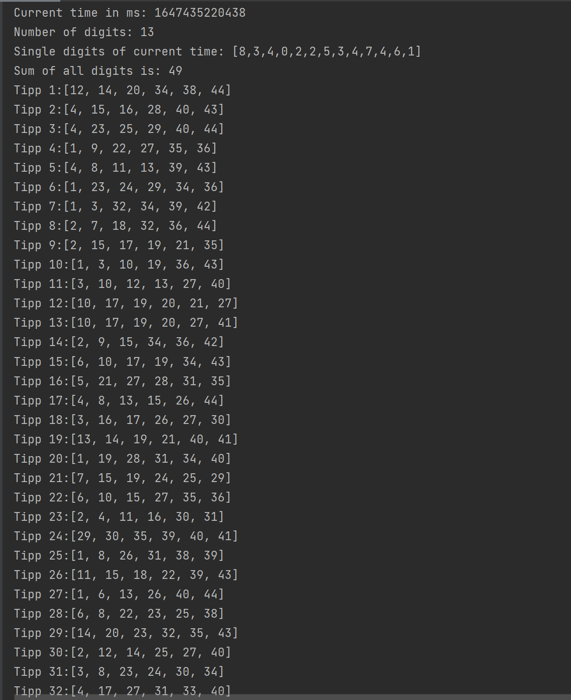

# Documentation
>You can see the documentation [here](README.md)

### Main program
>This is what the main class looks like
> 
> 

#### Output
>And here is a variant of one possible output
>

>###### Thank you for using the program!
> [Thank you](https://media3.giphy.com/media/F0J0uiNS8n0BHSQmDt/giphy.gif?cid=ecf05e47orajse3zrt317d0tk80asw614pc891pw2edp09am&rid=giphy.gif&ct=g)

