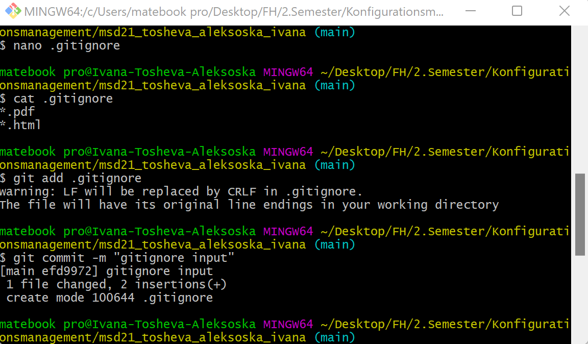
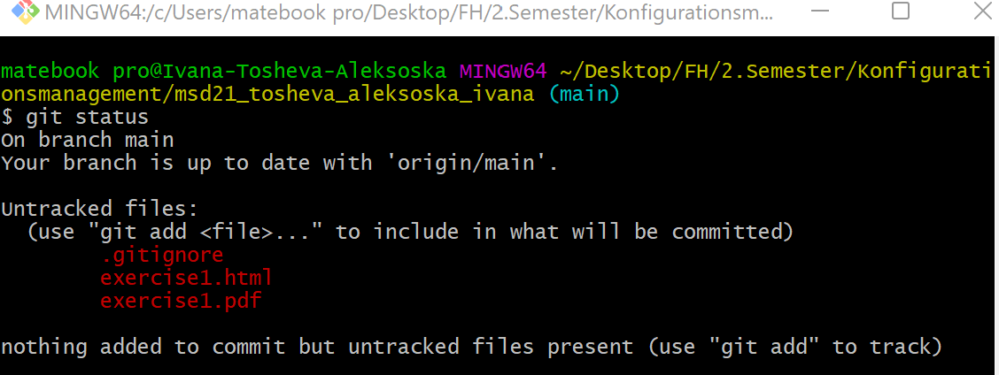
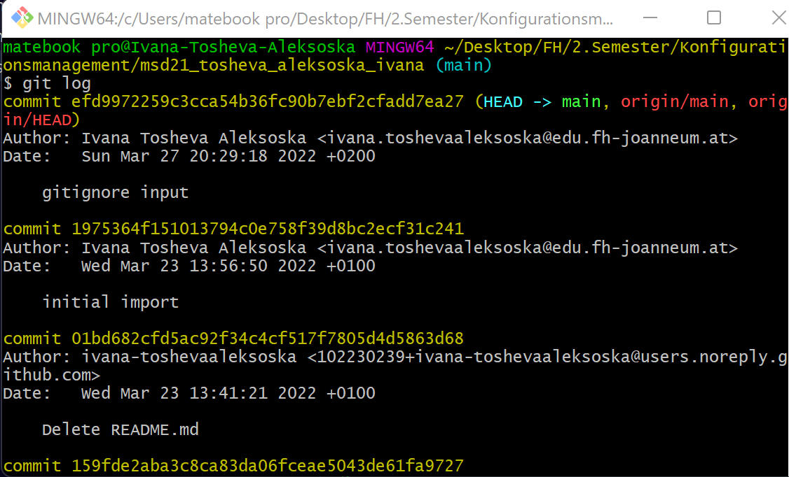
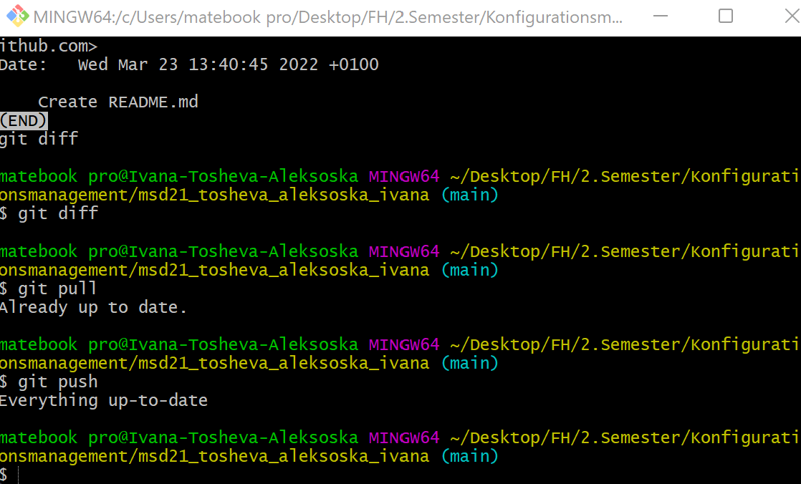
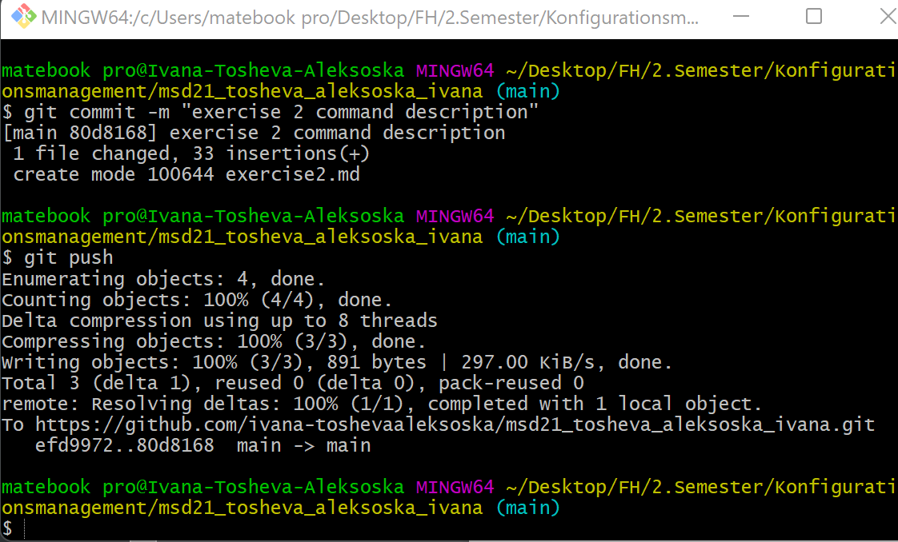

# Exercise 2 (git repository)

## Important commands with description  

 _git config_ - is a command that is used to set configuration values (name) that is correlated to the commits.  

 _git init_ - it's the first command that is used to open a new repository because other commands don't work outside of a repository (exept git config which is kind of a login command).  

 _git commit_- this command is used to save the changes to the local repository in the git repository. With _git commit -m_ a comment can be added to know what is commited.  

 _git add_ - it is used to add a changed file from the working directory to the staging area. Tells what file should be included in the next commit.  

  

 _git status_-  this command is used to show the status between the working directory and the stageing area. It shows the tracked and untracked files and the changes made.  

  

 _git log_ - is used to control the commit history.  

 

 _git diff_ - shows the difference in a file between two commits, or the difference between the current file and the commited file.

 _git pull_ - fetches the files from the online repository and updates the local repository.  

 

 _git push_ - sends the commits and pushes updates to the online repository.  

 
