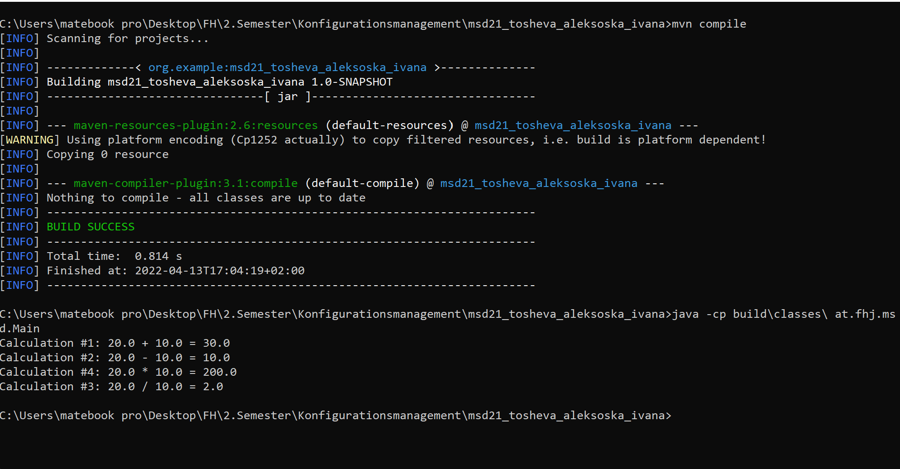

# Exercise 3 (Maven (Java) Project structure and Git)

## Steps 

  1. Installation of Maven and Java JDK 17  
  2. Setting Java_HOME and path variables  
  3. Check if everything is installed properly with 
     * mvn -v
     * java -version
     * javac -version  
  4. Create Maven Project in IntelliJ  
     * add the .idea folder to the gitignore file
     * create Java-Class Calculator in a package at.fhj.msd  
     * create the methods of the calculator class  
  5. Once the Project has been created and run for the first time, 
  a *target* folder is created
     
     * the _target_ folder is the directory in which the Maven generated output will be saved.
     * The target directory is created by Maven. 
     * It contains all the compiled classes, JAR files etc.
  6. Enter  
   * ```mvn compile```
   * then by entering
     ```java -cp build\classes\ at.fhj.msd.Main``` 
     the program is ran in the terminal  
     
    
     