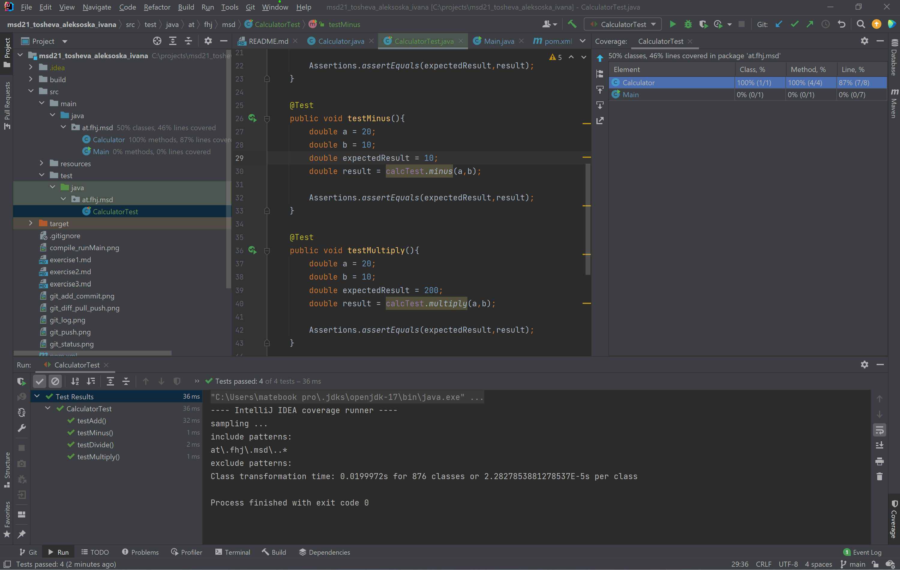
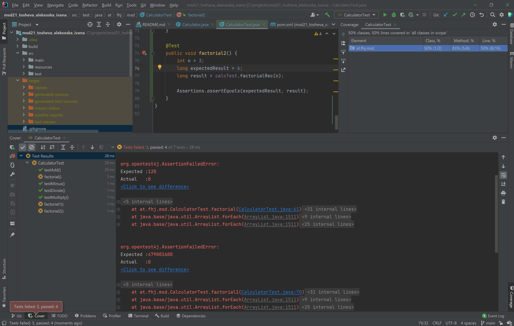

# Exercise 4 (SOURCE CODE TEST)  

## Steps 

The goal of the fourth exercise is to test a Java project using JUnit.
In order to be able to do this, first we have to set up 
the dependencies and unable the use of junit-jupiter which ie equivalent
to junit 5. That way we use the latest version with all the improvements.  
After that we create the CalculatorTest class.  
In this class we write all the phases of the tests:
1. SETUP  
2. TEARDOWN  
3. EXERCISE  
4. VERIFY  

and run the test with coverage through  
```More Run/Debug -> Run with coverage```  
In the testcases there are tests for the 4 calculation methods 
1. Add
2. Subtract
3. Divide
4. Multiply 

where the result is compared with the expected result and 
if they have the same value the test is successful 
.

In the following part of the exercise we implement the test 
for the factorial calculation, without implementing the method. 
As expected, we get an error from which we can notice the method 
hasn't been implemented .

Author: ```Ivana Tosheva Aleksoska```